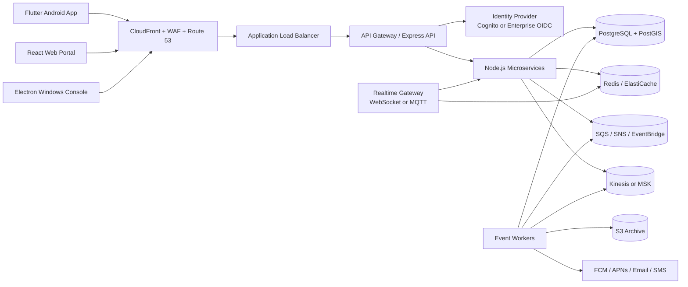
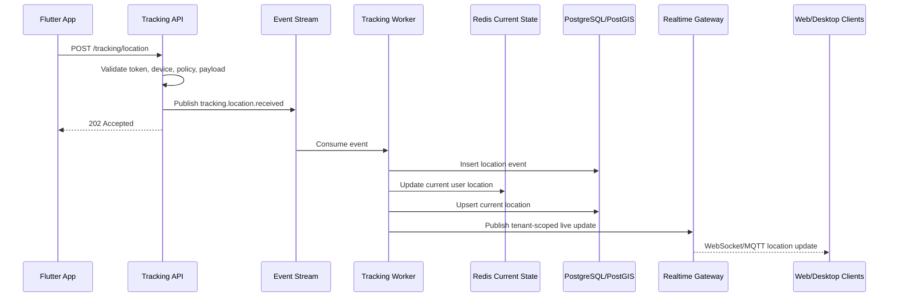
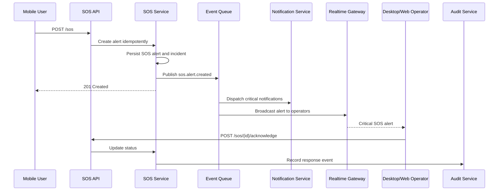

# Securitatem Defensionis Guardian Tracker

## Enterprise Tracking and Emergency Response Platform Architecture

### Document Status

- Version: 1.0
- Audience: executive sponsors, engineering leadership, product management, security, DevOps, backend, mobile, web, desktop, QA, and compliance teams
- Scope: production-ready architecture for a multi-client tracking and emergency response platform

---

## 1. Executive Summary

Securitatem Defensionis Guardian Tracker is an enterprise-grade personnel tracking, monitoring, and emergency response platform. It supports mobile field users, web-based administrators, Windows desktop monitoring operators, backend services, PostgreSQL persistence, and AWS cloud infrastructure.

The platform is designed for:

- Real-time location tracking for mobile personnel.
- SOS panic alerting with escalation workflows.
- Role-based operational dashboards.
- Secure identity and access management.
- Auditable incident management.
- Scalable processing for 100,000+ users.
- High availability and disaster recovery in AWS.

The recommended architecture uses a modular microservice backend, event-driven processing, managed cloud services, PostgreSQL with PostGIS for geospatial workloads, Redis for low-latency state, and WebSocket/MQTT channels for real-time communication.

---

## 2. Core Product Capabilities

### 2.1 Flutter Android Mobile Application

Primary users: field staff, security personnel, drivers, contractors, employees, and protected persons.

Capabilities:

- Secure login with MFA support.
- Device registration and attestation.
- Background GPS tracking.
- Configurable location sampling policies.
- Geofence awareness.
- SOS panic button.
- Silent distress mode.
- Incident status updates.
- Push notifications.
- Offline event queueing.
- Battery-aware tracking.
- Encrypted local storage.

### 2.2 React Web Portal

Primary users: administrators, supervisors, analysts, auditors, and customer account managers.

Capabilities:

- Organization and tenant administration.
- User, team, role, and device management.
- Live map visualization.
- Historical route playback.
- SOS incident review.
- Geofence configuration.
- Policy configuration.
- Reports and analytics.
- Audit log search.
- Billing and subscription integrations, if required.

### 2.3 Electron Windows Desktop Monitoring Console

Primary users: emergency response centers, security command centers, and continuous monitoring operators.

Capabilities:

- Always-on multi-screen monitoring.
- Real-time alert queue.
- Operator assignment and dispatch workflow.
- Audio and visual SOS notifications.
- Live tracking wallboard.
- Incident timeline.
- Escalation checklists.
- Offline-resilient operator state.
- Native Windows notifications.
- Optional kiosk or locked-down mode.

### 2.4 Node.js + Express Backend API

Responsibilities:

- Authentication gateway integration.
- REST and real-time APIs.
- Business workflow orchestration.
- Geospatial queries.
- SOS event processing.
- Notification dispatch.
- Audit logging.
- Policy enforcement.
- Integration endpoints.

### 2.5 PostgreSQL Database

Responsibilities:

- Transactional system of record.
- User, organization, role, and device data.
- Tracking events and geospatial indexes.
- SOS incidents and response workflow.
- Geofences.
- Audit logs.
- Configuration and policy storage.

Recommended extensions:

- PostGIS for geospatial data.
- pgcrypto for UUID generation where appropriate.
- pg_partman or native declarative partitioning for high-volume tracking data.

### 2.6 AWS Cloud Infrastructure

Responsibilities:

- Secure cloud hosting.
- Managed database, cache, queues, object storage, and observability.
- Elastic compute for APIs and workers.
- Global traffic routing.
- Disaster recovery.
- Secrets and key management.

---

## 3. High-Level System Architecture



### 3.1 Architectural Principles

- Security-first design with least privilege across users, services, and infrastructure.
- Event-driven processing for location ingestion, SOS alerts, notifications, and audit logs.
- Strong tenant isolation at the application, data, and observability layers.
- High availability across multiple availability zones.
- Horizontal scalability for stateless services.
- Clear separation between operational data, analytics data, and archive data.
- Privacy-aware location collection with policy controls and auditability.

---

## 4. Recommended Microservice Architecture

The platform should start as a well-modularized backend deployable as separate services where scaling, ownership, or compliance needs justify separation. For early production, some services can share a codebase while retaining clear module boundaries.

### 4.1 Service Boundaries

| Service | Primary Responsibility | Data Ownership |
| --- | --- | --- |
| API Gateway / BFF | Public REST API, request validation, auth context, client-specific aggregation | No primary data |
| Identity Service | User profiles, invitations, tenant membership, role mapping | Users, memberships |
| Device Service | Device registration, device posture, app versions, trust state | Devices, device sessions |
| Tracking Service | Location ingestion, current position, route history, geospatial queries | Location events, current locations |
| SOS Service | Panic alerts, incident lifecycle, escalation, operator assignment | SOS alerts, incidents |
| Geofence Service | Geofence definitions, rules, entry/exit events | Geofences, geofence events |
| Notification Service | Push, SMS, email, web, desktop notifications | Notification templates, deliveries |
| Audit Service | Immutable security and operational audit trails | Audit logs |
| Reporting Service | Reports, route playback exports, operational metrics | Read models and report jobs |
| Policy Service | Tracking policies, retention policies, alert rules | Policies |
| Integration Service | Webhooks, enterprise HR, SSO, SIEM, dispatch integrations | Integration configs |

### 4.2 Recommended Communication Patterns

- Synchronous REST:
  - User administration.
  - Device registration.
  - Dashboard queries.
  - Incident updates.
- Real-time bidirectional channels:
  - Live location updates.
  - SOS alert broadcast.
  - Operator console events.
- Asynchronous events:
  - Location received.
  - Geofence entered or exited.
  - SOS created, acknowledged, escalated, resolved.
  - Notification requested and delivered.
  - Audit record created.

### 4.3 Event Topics

Recommended event topics:

- `tracking.location.received`
- `tracking.location.validated`
- `tracking.location.current.updated`
- `geofence.transition.detected`
- `sos.alert.created`
- `sos.alert.acknowledged`
- `sos.alert.escalated`
- `sos.alert.resolved`
- `notification.dispatch.requested`
- `notification.dispatch.completed`
- `audit.event.recorded`
- `device.posture.changed`

### 4.4 Service Deployment Model

Recommended production deployment:

- Containerized Node.js services.
- AWS ECS Fargate or EKS for orchestration.
- One container image per service for independent scaling.
- Separate worker services for queue and stream consumers.
- Shared internal libraries for authentication middleware, logging, validation, and event contracts.

---

## 5. Component Folder Structures

The following structures are recommended for a production monorepo. If the organization prefers polyrepos, each top-level application can become its own repository while preserving the internal structure.

### 5.1 Repository Root

```text
guardian-tracker/
  apps/
    mobile-android/
    web-portal/
    desktop-console/
  services/
    api-gateway/
    identity-service/
    device-service/
    tracking-service/
    sos-service/
    geofence-service/
    notification-service/
    audit-service/
    reporting-service/
    policy-service/
    integration-service/
  packages/
    shared-types/
    auth-client/
    api-client/
    event-contracts/
    config/
    logger/
  database/
    migrations/
    seeds/
    fixtures/
    procedures/
  infrastructure/
    terraform/
    helm/
    docker/
    scripts/
  docs/
    architecture/
    api/
    security/
    runbooks/
    adr/
  tests/
    e2e/
    performance/
    contract/
  .github/
    workflows/
```

### 5.2 Flutter Android Mobile Application

```text
apps/mobile-android/
  android/
  assets/
    images/
    sounds/
    translations/
  lib/
    main.dart
    app/
      app.dart
      routes.dart
      theme.dart
    core/
      config/
      constants/
      errors/
      logging/
      permissions/
      secure_storage/
      networking/
      background_tasks/
    features/
      auth/
        data/
        domain/
        presentation/
      tracking/
        data/
        domain/
        presentation/
        background/
      sos/
        data/
        domain/
        presentation/
      notifications/
      profile/
      device/
      offline_queue/
    shared/
      widgets/
      models/
      utils/
  test/
  integration_test/
  pubspec.yaml
```

### 5.3 React Web Portal

```text
apps/web-portal/
  public/
  src/
    main.tsx
    app/
      App.tsx
      router.tsx
      providers.tsx
      layout/
    assets/
    components/
      common/
      maps/
      forms/
      tables/
      charts/
    features/
      auth/
      dashboard/
      live-tracking/
      sos-incidents/
      geofences/
      users/
      devices/
      reports/
      audit/
      settings/
    hooks/
    services/
      api/
      realtime/
      auth/
    state/
    styles/
    types/
    utils/
  tests/
  vite.config.ts
  package.json
```

### 5.4 Electron Windows Desktop Monitoring Console

```text
apps/desktop-console/
  src/
    main/
      main.ts
      windows/
      ipc/
      tray/
      auto-update/
      native-notifications/
    preload/
      index.ts
    renderer/
      main.tsx
      app/
      components/
      features/
        operator-dashboard/
        live-map/
        alert-queue/
        incident-detail/
        dispatch/
        shift-management/
      services/
        api/
        realtime/
        audio/
        local-cache/
      state/
      styles/
    shared/
      ipc-contracts/
      types/
      config/
  build/
  tests/
  electron-builder.yml
  package.json
```

### 5.5 Node.js + Express Service Structure

Use this structure for each service under `services/<service-name>/`.

```text
services/tracking-service/
  src/
    index.ts
    server.ts
    app.ts
    config/
      env.ts
      service.ts
    routes/
      tracking.routes.ts
    controllers/
      tracking.controller.ts
    domain/
      entities/
      services/
      policies/
      events/
    application/
      commands/
      queries/
      handlers/
    infrastructure/
      database/
        repositories/
        migrations/
      messaging/
      cache/
      clients/
    middleware/
      auth.ts
      validation.ts
      rate-limit.ts
      error-handler.ts
    schemas/
      request/
      response/
    observability/
      logger.ts
      metrics.ts
      tracing.ts
    tests/
      unit/
      integration/
      contract/
  Dockerfile
  package.json
  tsconfig.json
```

### 5.6 Database Folder

```text
database/
  migrations/
    001_enable_extensions.sql
    002_create_identity_schema.sql
    003_create_device_schema.sql
    004_create_tracking_schema.sql
    005_create_sos_schema.sql
    006_create_geofence_schema.sql
    007_create_audit_schema.sql
  seeds/
    local-dev/
    staging/
  procedures/
    geofence_transition_detection.sql
    retention_rollups.sql
  fixtures/
    demo-tenants.sql
```

### 5.7 AWS Infrastructure Folder

```text
infrastructure/
  terraform/
    environments/
      dev/
      staging/
      production/
    modules/
      vpc/
      ecs-service/
      rds-postgres/
      elasticache-redis/
      alb/
      cloudfront/
      waf/
      s3/
      sqs/
      sns/
      eventbridge/
      kinesis/
      cognito/
      kms/
      secrets-manager/
      observability/
  docker/
    node-service.Dockerfile
    nginx-web.Dockerfile
  scripts/
    deploy.sh
    migrate.sh
    rollback.sh
    smoke-test.sh
```

---

## 6. Database Architecture

### 6.1 Database Strategy

Recommended primary database:

- Amazon RDS for PostgreSQL or Amazon Aurora PostgreSQL.
- PostGIS enabled for geospatial queries.
- Multi-AZ enabled in production.
- Read replicas for analytics and reporting queries.
- Partitioned tracking tables by time and optionally tenant.
- Point-in-time recovery enabled.
- Encryption at rest with AWS KMS.

High-volume location data should be handled with:

- Current-state records in PostgreSQL and Redis.
- Recent route history in partitioned PostgreSQL.
- Long-term raw archives in S3.
- Optional analytics export to Redshift, Athena, or OpenSearch.

### 6.2 Core Schema Overview

```text
identity
  organizations
  users
  roles
  permissions
  user_roles
  teams
  team_members

device
  devices
  device_sessions
  device_health

tracking
  location_events
  current_locations
  route_segments

geofence
  geofences
  geofence_rules
  geofence_events

sos
  sos_alerts
  incidents
  incident_assignments
  incident_timeline

notification
  notification_templates
  notification_deliveries

audit
  audit_logs
```

### 6.3 Representative PostgreSQL Schema

```sql
CREATE EXTENSION IF NOT EXISTS postgis;
CREATE EXTENSION IF NOT EXISTS pgcrypto;
CREATE EXTENSION IF NOT EXISTS citext;

CREATE TYPE user_status AS ENUM ('invited', 'active', 'suspended', 'deleted');
CREATE TYPE device_status AS ENUM ('pending', 'trusted', 'blocked', 'retired');
CREATE TYPE sos_status AS ENUM ('new', 'acknowledged', 'assigned', 'escalated', 'resolved', 'cancelled');
CREATE TYPE incident_priority AS ENUM ('low', 'medium', 'high', 'critical');

CREATE TABLE organizations (
  id UUID PRIMARY KEY DEFAULT gen_random_uuid(),
  parent_organization_id UUID REFERENCES organizations(id),
  name VARCHAR(255) NOT NULL,
  slug VARCHAR(120) NOT NULL UNIQUE,
  status VARCHAR(50) NOT NULL DEFAULT 'active',
  metadata JSONB NOT NULL DEFAULT '{}',
  created_at TIMESTAMPTZ NOT NULL DEFAULT now(),
  updated_at TIMESTAMPTZ NOT NULL DEFAULT now()
);

CREATE TABLE users (
  id UUID PRIMARY KEY DEFAULT gen_random_uuid(),
  organization_id UUID NOT NULL REFERENCES organizations(id),
  external_identity_id VARCHAR(255),
  email CITEXT NOT NULL,
  phone_number VARCHAR(40),
  display_name VARCHAR(255) NOT NULL,
  status user_status NOT NULL DEFAULT 'invited',
  last_login_at TIMESTAMPTZ,
  created_at TIMESTAMPTZ NOT NULL DEFAULT now(),
  updated_at TIMESTAMPTZ NOT NULL DEFAULT now(),
  UNIQUE (organization_id, email)
);

CREATE TABLE roles (
  id UUID PRIMARY KEY DEFAULT gen_random_uuid(),
  organization_id UUID REFERENCES organizations(id),
  name VARCHAR(120) NOT NULL,
  description TEXT,
  created_at TIMESTAMPTZ NOT NULL DEFAULT now(),
  UNIQUE (organization_id, name)
);

CREATE TABLE permissions (
  id UUID PRIMARY KEY DEFAULT gen_random_uuid(),
  key VARCHAR(160) NOT NULL UNIQUE,
  description TEXT
);

CREATE TABLE role_permissions (
  role_id UUID NOT NULL REFERENCES roles(id) ON DELETE CASCADE,
  permission_id UUID NOT NULL REFERENCES permissions(id) ON DELETE CASCADE,
  PRIMARY KEY (role_id, permission_id)
);

CREATE TABLE user_roles (
  user_id UUID NOT NULL REFERENCES users(id) ON DELETE CASCADE,
  role_id UUID NOT NULL REFERENCES roles(id) ON DELETE CASCADE,
  PRIMARY KEY (user_id, role_id)
);

CREATE TABLE teams (
  id UUID PRIMARY KEY DEFAULT gen_random_uuid(),
  organization_id UUID NOT NULL REFERENCES organizations(id),
  name VARCHAR(160) NOT NULL,
  created_at TIMESTAMPTZ NOT NULL DEFAULT now(),
  UNIQUE (organization_id, name)
);

CREATE TABLE team_members (
  team_id UUID NOT NULL REFERENCES teams(id) ON DELETE CASCADE,
  user_id UUID NOT NULL REFERENCES users(id) ON DELETE CASCADE,
  PRIMARY KEY (team_id, user_id)
);

CREATE TABLE devices (
  id UUID PRIMARY KEY DEFAULT gen_random_uuid(),
  organization_id UUID NOT NULL REFERENCES organizations(id),
  user_id UUID REFERENCES users(id),
  platform VARCHAR(50) NOT NULL,
  device_identifier_hash VARCHAR(255) NOT NULL,
  app_version VARCHAR(50),
  os_version VARCHAR(100),
  status device_status NOT NULL DEFAULT 'pending',
  last_seen_at TIMESTAMPTZ,
  registered_at TIMESTAMPTZ NOT NULL DEFAULT now(),
  UNIQUE (organization_id, device_identifier_hash)
);

CREATE TABLE device_sessions (
  id UUID PRIMARY KEY DEFAULT gen_random_uuid(),
  device_id UUID NOT NULL REFERENCES devices(id),
  user_id UUID NOT NULL REFERENCES users(id),
  refresh_token_hash VARCHAR(255) NOT NULL,
  ip_address INET,
  user_agent TEXT,
  expires_at TIMESTAMPTZ NOT NULL,
  revoked_at TIMESTAMPTZ,
  created_at TIMESTAMPTZ NOT NULL DEFAULT now()
);

CREATE TABLE current_locations (
  user_id UUID PRIMARY KEY REFERENCES users(id),
  organization_id UUID NOT NULL REFERENCES organizations(id),
  device_id UUID REFERENCES devices(id),
  position GEOGRAPHY(Point, 4326) NOT NULL,
  accuracy_meters NUMERIC(8,2),
  speed_mps NUMERIC(8,2),
  heading_degrees NUMERIC(6,2),
  battery_percent NUMERIC(5,2),
  captured_at TIMESTAMPTZ NOT NULL,
  received_at TIMESTAMPTZ NOT NULL DEFAULT now(),
  metadata JSONB NOT NULL DEFAULT '{}'
);

CREATE INDEX idx_current_locations_org_position
  ON current_locations USING GIST (position);

CREATE TABLE location_events (
  id BIGSERIAL,
  organization_id UUID NOT NULL REFERENCES organizations(id),
  user_id UUID NOT NULL REFERENCES users(id),
  device_id UUID REFERENCES devices(id),
  position GEOGRAPHY(Point, 4326) NOT NULL,
  accuracy_meters NUMERIC(8,2),
  speed_mps NUMERIC(8,2),
  heading_degrees NUMERIC(6,2),
  battery_percent NUMERIC(5,2),
  source VARCHAR(50) NOT NULL DEFAULT 'mobile_gps',
  captured_at TIMESTAMPTZ NOT NULL,
  received_at TIMESTAMPTZ NOT NULL DEFAULT now(),
  metadata JSONB NOT NULL DEFAULT '{}',
  PRIMARY KEY (id, captured_at)
) PARTITION BY RANGE (captured_at);

CREATE INDEX idx_location_events_org_user_time
  ON location_events (organization_id, user_id, captured_at DESC);

CREATE INDEX idx_location_events_position
  ON location_events USING GIST (position);

CREATE TABLE geofences (
  id UUID PRIMARY KEY DEFAULT gen_random_uuid(),
  organization_id UUID NOT NULL REFERENCES organizations(id),
  name VARCHAR(255) NOT NULL,
  description TEXT,
  boundary GEOGRAPHY(Polygon, 4326) NOT NULL,
  status VARCHAR(50) NOT NULL DEFAULT 'active',
  created_by UUID REFERENCES users(id),
  created_at TIMESTAMPTZ NOT NULL DEFAULT now(),
  updated_at TIMESTAMPTZ NOT NULL DEFAULT now()
);

CREATE INDEX idx_geofences_boundary
  ON geofences USING GIST (boundary);

CREATE TABLE geofence_events (
  id UUID PRIMARY KEY DEFAULT gen_random_uuid(),
  organization_id UUID NOT NULL REFERENCES organizations(id),
  geofence_id UUID NOT NULL REFERENCES geofences(id),
  user_id UUID NOT NULL REFERENCES users(id),
  event_type VARCHAR(30) NOT NULL,
  position GEOGRAPHY(Point, 4326) NOT NULL,
  occurred_at TIMESTAMPTZ NOT NULL,
  created_at TIMESTAMPTZ NOT NULL DEFAULT now()
);

CREATE TABLE sos_alerts (
  id UUID PRIMARY KEY DEFAULT gen_random_uuid(),
  organization_id UUID NOT NULL REFERENCES organizations(id),
  user_id UUID NOT NULL REFERENCES users(id),
  device_id UUID REFERENCES devices(id),
  status sos_status NOT NULL DEFAULT 'new',
  priority incident_priority NOT NULL DEFAULT 'critical',
  trigger_type VARCHAR(60) NOT NULL,
  initial_position GEOGRAPHY(Point, 4326),
  last_known_position GEOGRAPHY(Point, 4326),
  message TEXT,
  captured_at TIMESTAMPTZ NOT NULL,
  created_at TIMESTAMPTZ NOT NULL DEFAULT now(),
  acknowledged_at TIMESTAMPTZ,
  resolved_at TIMESTAMPTZ
);

CREATE INDEX idx_sos_alerts_org_status_created
  ON sos_alerts (organization_id, status, created_at DESC);

CREATE INDEX idx_sos_alerts_position
  ON sos_alerts USING GIST (last_known_position);

CREATE TABLE incidents (
  id UUID PRIMARY KEY DEFAULT gen_random_uuid(),
  organization_id UUID NOT NULL REFERENCES organizations(id),
  sos_alert_id UUID REFERENCES sos_alerts(id),
  title VARCHAR(255) NOT NULL,
  status sos_status NOT NULL DEFAULT 'new',
  priority incident_priority NOT NULL DEFAULT 'critical',
  assigned_team_id UUID REFERENCES teams(id),
  created_by UUID REFERENCES users(id),
  created_at TIMESTAMPTZ NOT NULL DEFAULT now(),
  updated_at TIMESTAMPTZ NOT NULL DEFAULT now(),
  resolved_at TIMESTAMPTZ
);

CREATE TABLE incident_assignments (
  incident_id UUID NOT NULL REFERENCES incidents(id) ON DELETE CASCADE,
  assignee_user_id UUID NOT NULL REFERENCES users(id),
  assigned_by UUID REFERENCES users(id),
  assigned_at TIMESTAMPTZ NOT NULL DEFAULT now(),
  PRIMARY KEY (incident_id, assignee_user_id)
);

CREATE TABLE incident_timeline (
  id UUID PRIMARY KEY DEFAULT gen_random_uuid(),
  incident_id UUID NOT NULL REFERENCES incidents(id) ON DELETE CASCADE,
  actor_user_id UUID REFERENCES users(id),
  event_type VARCHAR(100) NOT NULL,
  details JSONB NOT NULL DEFAULT '{}',
  created_at TIMESTAMPTZ NOT NULL DEFAULT now()
);

CREATE TABLE notification_deliveries (
  id UUID PRIMARY KEY DEFAULT gen_random_uuid(),
  organization_id UUID NOT NULL REFERENCES organizations(id),
  recipient_user_id UUID REFERENCES users(id),
  channel VARCHAR(50) NOT NULL,
  template_key VARCHAR(120),
  payload JSONB NOT NULL DEFAULT '{}',
  provider_message_id VARCHAR(255),
  status VARCHAR(50) NOT NULL DEFAULT 'pending',
  error_message TEXT,
  created_at TIMESTAMPTZ NOT NULL DEFAULT now(),
  sent_at TIMESTAMPTZ
);

CREATE TABLE audit_logs (
  id BIGSERIAL PRIMARY KEY,
  organization_id UUID REFERENCES organizations(id),
  actor_user_id UUID REFERENCES users(id),
  actor_type VARCHAR(50) NOT NULL,
  action VARCHAR(160) NOT NULL,
  resource_type VARCHAR(120),
  resource_id VARCHAR(120),
  ip_address INET,
  user_agent TEXT,
  details JSONB NOT NULL DEFAULT '{}',
  created_at TIMESTAMPTZ NOT NULL DEFAULT now()
);

CREATE INDEX idx_audit_logs_org_created
  ON audit_logs (organization_id, created_at DESC);
```

### 6.4 Partitioning Strategy

Recommended partitions:

- `location_events`: monthly or weekly partitions by `captured_at`.
- `audit_logs`: monthly partitions by `created_at`.
- `notification_deliveries`: monthly partitions by `created_at`.
- Optional tenant partitioning for very large enterprise tenants.

Retention:

- Current location: latest record only.
- High-resolution location events: configurable, for example 30 to 180 days.
- Downsampled route history: 1 to 7 years depending on compliance.
- SOS incidents and audit logs: retain according to legal and contractual policy.
- Archived raw events: S3 lifecycle rules to Glacier.

---

## 7. API Architecture

### 7.1 API Style

Recommended:

- REST for operational APIs.
- WebSocket or MQTT for real-time event delivery.
- OpenAPI 3.1 for API contracts.
- JSON schema validation at service boundaries.
- Idempotency keys for high-risk commands, especially SOS creation.
- Cursor-based pagination for large lists.
- Versioned API prefix: `/api/v1`.

### 7.2 REST Endpoint Groups

#### Authentication and Session

```text
POST   /api/v1/auth/login
POST   /api/v1/auth/mfa/verify
POST   /api/v1/auth/refresh
POST   /api/v1/auth/logout
GET    /api/v1/auth/me
```

When using Cognito or an enterprise OIDC provider, login can be handled by hosted identity flows while backend APIs validate tokens.

#### Organizations and Users

```text
GET    /api/v1/organizations
POST   /api/v1/organizations
GET    /api/v1/organizations/{organizationId}
PATCH  /api/v1/organizations/{organizationId}

GET    /api/v1/users
POST   /api/v1/users
GET    /api/v1/users/{userId}
PATCH  /api/v1/users/{userId}
DELETE /api/v1/users/{userId}
POST   /api/v1/users/{userId}/roles
DELETE /api/v1/users/{userId}/roles/{roleId}
```

#### Devices

```text
POST   /api/v1/devices/register
GET    /api/v1/devices
GET    /api/v1/devices/{deviceId}
PATCH  /api/v1/devices/{deviceId}
POST   /api/v1/devices/{deviceId}/trust
POST   /api/v1/devices/{deviceId}/block
POST   /api/v1/devices/{deviceId}/retire
```

#### Tracking

```text
POST   /api/v1/tracking/location
POST   /api/v1/tracking/location/batch
GET    /api/v1/tracking/current
GET    /api/v1/tracking/users/{userId}/current
GET    /api/v1/tracking/users/{userId}/history
GET    /api/v1/tracking/nearby
GET    /api/v1/tracking/routes/{routeId}
```

#### SOS and Incidents

```text
POST   /api/v1/sos
GET    /api/v1/sos
GET    /api/v1/sos/{alertId}
POST   /api/v1/sos/{alertId}/acknowledge
POST   /api/v1/sos/{alertId}/cancel
POST   /api/v1/sos/{alertId}/escalate

GET    /api/v1/incidents
POST   /api/v1/incidents
GET    /api/v1/incidents/{incidentId}
PATCH  /api/v1/incidents/{incidentId}
POST   /api/v1/incidents/{incidentId}/assign
POST   /api/v1/incidents/{incidentId}/resolve
GET    /api/v1/incidents/{incidentId}/timeline
POST   /api/v1/incidents/{incidentId}/timeline
```

#### Geofences

```text
GET    /api/v1/geofences
POST   /api/v1/geofences
GET    /api/v1/geofences/{geofenceId}
PATCH  /api/v1/geofences/{geofenceId}
DELETE /api/v1/geofences/{geofenceId}
GET    /api/v1/geofences/events
```

#### Notifications

```text
GET    /api/v1/notifications
POST   /api/v1/notifications/test
PATCH  /api/v1/notifications/{notificationId}/read
GET    /api/v1/notification-preferences
PATCH  /api/v1/notification-preferences
```

#### Reporting and Audit

```text
GET    /api/v1/reports/location-summary
POST   /api/v1/reports/export
GET    /api/v1/reports/jobs/{jobId}
GET    /api/v1/audit-logs
```

### 7.3 Request Example: Location Ingestion

```json
{
  "deviceId": "b7fa69a5-6d6f-45f3-9e9e-5998558803e6",
  "capturedAt": "2026-06-25T17:31:00Z",
  "latitude": 51.5074,
  "longitude": -0.1278,
  "accuracyMeters": 8.4,
  "speedMps": 1.2,
  "headingDegrees": 180.0,
  "batteryPercent": 74,
  "metadata": {
    "provider": "gps",
    "networkType": "lte"
  }
}
```

### 7.4 API Gateway Concerns

- Validate JWT and attach tenant, user, role, and device context.
- Enforce rate limits per tenant, user, device, and endpoint.
- Reject requests from blocked devices.
- Enforce request size limits.
- Apply input validation before service execution.
- Emit structured audit events.
- Generate correlation IDs.
- Support idempotency for `POST /sos` and batch location ingestion.

---

## 8. Authentication and Authorization Architecture

### 8.1 Identity Provider

Recommended options:

- AWS Cognito for managed identity and MFA.
- Enterprise OIDC/SAML federation for customer SSO.
- Optional internal identity service for tenant membership and application-specific roles.

### 8.2 Authentication Flows

#### Mobile App

1. User authenticates with OIDC authorization code flow with PKCE.
2. MFA is required based on tenant policy.
3. Device registration occurs after first trusted login.
4. App stores refresh token in Android Keystore-backed secure storage.
5. API calls use short-lived access tokens.
6. Background tracking uses scoped tokens or a device session token with strict revocation.

#### React Web Portal

1. Browser uses OIDC authorization code flow with PKCE.
2. Access tokens are stored in memory where possible.
3. Refresh token rotation is enabled where supported.
4. Admin actions require step-up authentication for sensitive operations.

#### Electron Desktop Console

1. Operator authenticates through OIDC with PKCE.
2. Device or workstation trust can be enforced through endpoint management integration.
3. Long-running console sessions use refresh token rotation.
4. Shift lock, idle timeout, and re-authentication policies are enforced.

### 8.3 Authorization Model

Use a hybrid RBAC and ABAC model.

RBAC examples:

- `tenant_admin`
- `security_manager`
- `monitoring_operator`
- `dispatcher`
- `field_user`
- `auditor`
- `support_admin`

ABAC attributes:

- Tenant and organization hierarchy.
- Team membership.
- Incident assignment.
- User location policy.
- Device trust state.
- Data classification.
- Time-of-day or shift status.

Example permissions:

- `tracking:read:current`
- `tracking:read:history`
- `tracking:write:location`
- `sos:create`
- `sos:acknowledge`
- `sos:resolve`
- `geofence:manage`
- `users:manage`
- `audit:read`
- `reports:export`

### 8.4 Token Strategy

- Access token TTL: 5 to 15 minutes.
- Refresh token TTL: tenant policy, typically 8 hours to 30 days depending on client type.
- Refresh token rotation: required.
- Token revocation: supported through session records and identity provider revocation.
- Service-to-service auth: mTLS or signed JWT client credentials.
- Machine secrets: stored in AWS Secrets Manager.

---

## 9. Real-Time Tracking Architecture

### 9.1 Tracking Data Flow



### 9.2 Mobile Tracking Strategy

Tracking mode should be policy-driven:

- Active emergency mode: highest precision, shortest interval.
- On-duty active mode: balanced precision and battery usage.
- Low-power mode: reduced interval and significant-change updates.
- Stationary mode: suspend high-frequency updates until movement resumes.
- Offline mode: store encrypted events locally and batch upload when connected.

Recommended data collection controls:

- Minimum distance threshold.
- Minimum time threshold.
- Accuracy threshold.
- Battery threshold.
- Tenant-level privacy schedule.
- User consent and employment policy controls.

### 9.3 Real-Time Gateway

Options:

- AWS IoT Core MQTT for mobile telemetry and command channels.
- API Gateway WebSocket for web and desktop live feeds.
- Custom WebSocket service on ECS/EKS for advanced tenant routing.

Recommended approach:

- Use HTTP ingestion for location writes where reliability and validation are critical.
- Use WebSocket for operator dashboards and monitoring console updates.
- Use Redis pub/sub, Redis streams, or a managed broker to fan out events to connected clients.
- Use tenant-scoped channels, for example `tenant:{tenantId}:tracking`.

### 9.4 Current Location Cache

Redis keys:

```text
tenant:{tenantId}:user:{userId}:current_location
tenant:{tenantId}:team:{teamId}:active_users
tenant:{tenantId}:live_tracking:subscriptions
```

Cache strategy:

- Redis stores latest active location for fast dashboard rendering.
- PostgreSQL remains the durable source of truth.
- Time-to-live values remove stale active users from live maps.
- Update events include monotonic timestamps to reject stale writes.

---

## 10. SOS Alert Architecture

### 10.1 SOS Lifecycle

```text
new -> acknowledged -> assigned -> escalated -> resolved
                 \-> cancelled
```

### 10.2 SOS Alert Flow



### 10.3 SOS Requirements

- SOS action must be available from the mobile app home screen.
- SOS creation must be idempotent to avoid duplicate incidents during retries.
- SOS requests must include the best available last known location.
- SOS must work during poor connectivity:
  - Try immediate API call.
  - Retry with exponential backoff.
  - Send SMS fallback to a configured gateway if required by region.
  - Locally store pending distress event until confirmed.
- SOS must bypass normal low-power tracking mode and temporarily enable emergency tracking.
- Operators must receive visual and audible notifications.
- Incidents must maintain an immutable timeline.
- All status changes must be audited.

### 10.4 Escalation Rules

Example configurable rules:

- If unacknowledged after 30 seconds, notify secondary operators.
- If unacknowledged after 90 seconds, notify security manager.
- If not resolved after configured threshold, escalate to external dispatch integration.
- If user location changes during active SOS, update incident last known position.
- If device goes offline during active SOS, create a high-priority timeline entry.

### 10.5 SOS Data Consistency

Recommended:

- Single database transaction for SOS alert, incident, and initial timeline record.
- Outbox pattern to publish SOS events reliably after commit.
- Idempotency key from mobile app for duplicate suppression.
- Optimistic concurrency control on incident status transitions.

---

## 11. Security Architecture

### 11.1 Security Objectives

- Protect sensitive identity, location, and emergency data.
- Prevent unauthorized tracking and privilege escalation.
- Preserve integrity of incident response workflows.
- Provide forensic-grade auditability.
- Meet enterprise security and compliance requirements.

### 11.2 Data Classification

| Data Type | Classification | Controls |
| --- | --- | --- |
| Credentials and tokens | Restricted | KMS, Secrets Manager, secure storage, rotation |
| Live location | Highly confidential | TLS, RBAC/ABAC, audit, retention controls |
| SOS incidents | Highly confidential | Least privilege, immutable timeline, alerting |
| User profiles | Confidential | Tenant isolation, access logging |
| Audit logs | Restricted | Append-only, limited access, retention policy |
| Reports and exports | Confidential | Signed URLs, expiration, watermarking |

### 11.3 Application Security

- Enforce TLS 1.2+ everywhere, TLS 1.3 preferred.
- Use secure headers: HSTS, CSP, X-Content-Type-Options, Referrer-Policy.
- Use OWASP ASVS as the application security baseline.
- Validate all inputs with schemas.
- Parameterize all SQL.
- Use centralized authorization middleware.
- Avoid exposing internal IDs across tenants without scoped authorization checks.
- Rate-limit sensitive endpoints.
- Use idempotency and replay protection for critical commands.
- Generate audit records for all administrative and emergency actions.

### 11.4 Mobile Security

- Store tokens in Android Keystore-backed secure storage.
- Encrypt offline event queue.
- Detect rooted or compromised devices where policy requires it.
- Use certificate pinning where operationally supportable.
- Require app integrity checks for high-security tenants.
- Obfuscate production builds.
- Avoid storing historical locations unencrypted on device.

### 11.5 Web Security

- OIDC authorization code flow with PKCE.
- Strict Content Security Policy.
- SameSite cookies if cookies are used.
- In-memory token storage where feasible.
- Step-up authentication for privileged operations.
- CSRF protection for cookie-authenticated endpoints.

### 11.6 Electron Security

- Disable Node.js integration in renderer.
- Enable context isolation.
- Use a minimal preload bridge.
- Validate all IPC messages.
- Enforce code signing for Windows builds.
- Enable auto-update signature verification.
- Store secrets with Windows Credential Manager or secure storage abstraction.

### 11.7 Infrastructure Security

- Private subnets for services and databases.
- Public access only through CloudFront, WAF, and load balancers.
- Security groups with least privilege.
- IAM roles per service.
- KMS encryption for RDS, S3, SQS, SNS, CloudWatch, and backups.
- Secrets Manager for credentials and API keys.
- GuardDuty, Security Hub, AWS Config, and CloudTrail enabled.
- VPC endpoints for private AWS service access.

### 11.8 Compliance and Privacy

Recommended controls:

- Tenant-configurable data retention.
- Purpose limitation for location tracking.
- Consent capture where legally required.
- Administrative access reviews.
- Audit export for compliance.
- Data subject request workflows.
- Regional data residency support if required.
- Break-glass access process with mandatory audit and review.

---

## 12. Deployment Architecture

### 12.1 AWS Reference Architecture

```text
Route 53
  -> CloudFront
    -> AWS WAF
      -> Application Load Balancer
        -> ECS Fargate or EKS services

Private subnets:
  - Node.js API services
  - Worker services
  - Realtime gateway
  - Redis / ElastiCache
  - RDS PostgreSQL / Aurora PostgreSQL

Managed services:
  - Cognito or external OIDC
  - SQS, SNS, EventBridge
  - Kinesis or MSK
  - S3
  - Secrets Manager
  - KMS
  - CloudWatch
  - OpenSearch optional for log search
```

### 12.2 Environments

Recommended environments:

- Local development.
- Shared development.
- Integration testing.
- Staging.
- Production.
- Disaster recovery environment.

Each environment should have isolated:

- AWS account or at least isolated VPC and IAM boundaries.
- Database instance.
- Secrets.
- Identity provider tenant or app client.
- Observability streams.

### 12.3 CI/CD Pipeline

Recommended stages:

1. Static checks:
   - TypeScript type checking.
   - Dart analysis.
   - ESLint.
   - Unit tests.
   - Dependency vulnerability scanning.
2. Build:
   - Backend container images.
   - React static assets.
   - Electron signed installer.
   - Flutter Android APK/AAB.
3. Test:
   - Integration tests.
   - API contract tests.
   - Database migration tests.
   - End-to-end smoke tests.
4. Security:
   - SAST.
   - Container scanning.
   - IaC scanning.
   - Secret scanning.
5. Deploy:
   - Terraform plan and apply.
   - Database migrations.
   - Blue/green or rolling service deployment.
   - Post-deploy smoke tests.

### 12.4 Deployment Targets

| Component | Recommended Deployment |
| --- | --- |
| Flutter Android | Managed Google Play, enterprise MDM, or private distribution |
| React Web Portal | S3 + CloudFront or containerized Nginx behind CloudFront |
| Electron Console | Signed Windows installer, enterprise software distribution, auto-update channel |
| Node.js APIs | ECS Fargate or EKS |
| Workers | ECS Fargate or EKS autoscaled consumers |
| PostgreSQL | Aurora PostgreSQL or RDS PostgreSQL Multi-AZ |
| Redis | ElastiCache Redis cluster |
| Static assets | S3 + CloudFront |
| Logs and metrics | CloudWatch, OpenTelemetry, optional Datadog/New Relic |

### 12.5 Observability

Required:

- Structured JSON logs with correlation IDs.
- Distributed tracing with OpenTelemetry.
- RED metrics for APIs: rate, errors, duration.
- Worker lag metrics.
- Queue depth metrics.
- WebSocket connection counts.
- Location ingestion throughput.
- SOS alert latency.
- Notification delivery success rates.
- Database query latency and lock monitoring.
- Audit log integrity checks.

Critical alerts:

- SOS creation failure rate above threshold.
- SOS notification latency above threshold.
- Location ingestion backlog.
- Database CPU, storage, or connection saturation.
- Redis memory pressure.
- WebSocket gateway disconnect spikes.
- Error budget burn rate.

---

## 13. Scalability Strategy for 100,000+ Users

### 13.1 Capacity Assumptions

Example planning assumptions:

- 100,000 registered users.
- 20,000 to 40,000 concurrent mobile users during peak periods.
- Location update interval between 5 and 60 seconds depending on policy.
- 1,000 to 8,000 location events per second at peak depending on tracking mode.
- 500 to 2,000 concurrent web and desktop operators.
- SOS traffic is low volume but mission critical and latency sensitive.

### 13.2 Horizontal Scaling

Scale independently:

- API gateway service by request rate and CPU.
- Tracking ingestion service by event rate.
- Tracking workers by stream lag.
- Realtime gateway by concurrent connections.
- Notification workers by queue depth.
- Reporting workers by job backlog.

Use autoscaling signals:

- CPU and memory.
- Requests per target.
- Queue depth.
- Stream consumer lag.
- WebSocket connection count.
- Custom SOS processing latency metrics.

### 13.3 Database Scaling

Recommended:

- Partition `location_events`.
- Keep hot current location reads in Redis.
- Use read replicas for dashboards and reports.
- Use connection pooling through PgBouncer or RDS Proxy.
- Move long-running reports to asynchronous jobs.
- Archive older location events to S3.
- Maintain geospatial indexes carefully and monitor bloat.
- Use batch writes for location events where acceptable.

### 13.4 Event Processing Scaling

Recommended:

- Use Kinesis, MSK, or another partitioned stream for location ingestion.
- Partition by `organizationId` or `userId` depending on ordering needs.
- Preserve per-user ordering for location events.
- Use SQS for command-style background jobs.
- Use dead-letter queues for failed processing.
- Use outbox pattern for reliable domain event publication.

### 13.5 Realtime Scaling

Recommended:

- Maintain stateless WebSocket gateway nodes.
- Store connection metadata in Redis.
- Use tenant-scoped channels to minimize fan-out.
- Send viewport-based map updates instead of all tenant locations.
- Coalesce high-frequency location events for dashboards.
- Apply backpressure for slow clients.
- Use binary protocols only if JSON becomes a measured bottleneck.

### 13.6 Client-Side Scaling

Mobile:

- Adaptive update intervals.
- Local batching.
- Offline queue compaction.
- Battery-aware behavior.

Web and desktop:

- Map viewport filtering.
- Clustered map markers.
- Incremental updates.
- Virtualized tables.
- Server-side pagination.

### 13.7 Multi-Tenant Scaling

Recommended:

- Tenant ID on every tenant-owned table.
- Tenant-aware authorization in every query.
- Optional dedicated database or schema for very large or regulated tenants.
- Tenant-specific rate limits.
- Tenant-specific retention policies.
- Tenant-scoped encryption keys for high-security customers if required.

---

## 14. Reliability and Disaster Recovery

### 14.1 Availability Targets

Recommended target:

- Core APIs: 99.9% or higher.
- SOS alert path: 99.95% or higher with special operational focus.
- Tracking ingestion: designed for graceful degradation and replay.
- Reporting: lower priority than SOS and live tracking.

### 14.2 Failure Handling

- Mobile app queues events offline.
- Backend returns 202 for accepted telemetry and processes asynchronously.
- SOS path uses retry, idempotency, and notification redundancy.
- Workers use dead-letter queues.
- Services fail closed for authorization.
- Realtime clients reconnect with exponential backoff.

### 14.3 Disaster Recovery

Recommended:

- RDS/Aurora automated backups and PITR.
- Cross-region snapshot copy.
- S3 cross-region replication for critical archives.
- Infrastructure as code for full environment recreation.
- Documented runbooks for RDS failover, queue replay, and DNS cutover.
- Regular restore tests.

---

## 15. Recommended Technology Stack

| Layer | Recommendation |
| --- | --- |
| Mobile | Flutter, Dart, Android native background services integration |
| Web | React, TypeScript, Vite, TanStack Query, Zustand or Redux Toolkit |
| Desktop | Electron, TypeScript, React renderer, electron-builder |
| Backend | Node.js, TypeScript, Express, Zod/Joi validation |
| Database | PostgreSQL, PostGIS, RDS/Aurora |
| Cache | Redis / ElastiCache |
| Messaging | SQS, SNS, EventBridge, Kinesis or MSK |
| Auth | Cognito or enterprise OIDC/SAML federation |
| Infrastructure | AWS, Terraform, ECS Fargate or EKS |
| Observability | OpenTelemetry, CloudWatch, X-Ray, optional Datadog/New Relic |
| CI/CD | GitHub Actions or AWS CodePipeline |

---

## 16. Key Non-Functional Requirements

### 16.1 Performance

- Location ingestion API p95 below 300 ms for accepted requests.
- Web and desktop live update delivery p95 below 2 seconds under normal load.
- SOS alert creation p95 below 500 ms excluding external notification provider latency.
- Dashboard current-location load p95 below 1.5 seconds for typical teams.

### 16.2 Security

- MFA for privileged users.
- Strict tenant isolation.
- Full audit trail for privileged and emergency actions.
- Encryption in transit and at rest.
- Secure mobile and desktop token storage.

### 16.3 Operational

- Zero-downtime deployments for backend services.
- Backward-compatible API changes.
- Database migrations tested before deployment.
- Feature flags for risky capabilities.
- Runbooks for incident response.

---

## 17. Implementation Roadmap

### Phase 1: Foundation

- Establish monorepo or polyrepo strategy.
- Implement infrastructure baseline.
- Configure identity provider.
- Build core backend gateway.
- Create database migrations.
- Implement user, organization, role, and device services.

### Phase 2: Tracking MVP

- Implement mobile authentication and device registration.
- Implement location ingestion.
- Implement current location cache and history storage.
- Implement web live map.
- Implement real-time gateway.

### Phase 3: SOS and Monitoring

- Implement SOS creation and incident lifecycle.
- Implement desktop monitoring console.
- Implement notification service.
- Implement escalation rules.
- Implement audit trails and response timelines.

### Phase 4: Enterprise Hardening

- Add geofencing.
- Add reports and exports.
- Add SSO/SAML support.
- Add SIEM and webhook integrations.
- Add advanced policy controls.
- Run performance and disaster recovery testing.

### Phase 5: Scale Optimization

- Tune database partitions and indexes.
- Add analytics/archive pipeline.
- Optimize map fan-out and viewport filtering.
- Add tenant-level scaling controls.
- Mature observability and SLO dashboards.

---

## 18. Architecture Risks and Mitigations

| Risk | Impact | Mitigation |
| --- | --- | --- |
| High-volume location writes overload PostgreSQL | Delayed tracking and dashboard stale data | Stream ingestion, batch writes, partitioning, Redis current state, archive pipeline |
| Mobile OS limits background tracking | Missing location updates | Native Android foreground service, policy tuning, user education, MDM guidance |
| SOS notification provider outage | Delayed emergency response | Multi-channel notification strategy, provider fallback, in-console real-time alerts |
| Tenant data leakage | Severe security incident | Tenant-scoped authorization, automated tests, row-level security evaluation, audit logging |
| WebSocket fan-out overload | Delayed dashboards | Tenant channels, viewport filtering, event coalescing, gateway autoscaling |
| Excessive battery consumption | Poor mobile adoption | Adaptive sampling, movement detection, emergency-only high-frequency mode |
| Geospatial queries become slow | Poor dashboard and search performance | PostGIS indexes, query bounding boxes, read replicas, cache hot views |

---

## 19. Production Readiness Checklist

- [ ] OpenAPI specification published and versioned.
- [ ] Database migrations are repeatable and tested.
- [ ] All services emit structured logs, metrics, and traces.
- [ ] MFA and RBAC are enforced for privileged users.
- [ ] Mobile secure storage and offline queue encryption are implemented.
- [ ] SOS idempotency and escalation rules are tested.
- [ ] Notification providers have fallback behavior.
- [ ] Location tables are partitioned.
- [ ] Redis cache invalidation and stale-location handling are tested.
- [ ] Disaster recovery restore test completed.
- [ ] Load test validates 100,000+ user target assumptions.
- [ ] Security review and penetration test completed.
- [ ] Incident response runbooks are documented.
- [ ] Data retention policies are implemented and auditable.

---

## 20. Conclusion

Securitatem Defensionis Guardian Tracker should be built as a secure, event-driven, cloud-native emergency response platform. The most important architectural priorities are reliable SOS handling, privacy-aware real-time tracking, strong tenant isolation, and scalable location ingestion.

The recommended design uses Flutter, React, Electron, Node.js/Express, PostgreSQL/PostGIS, Redis, and AWS managed services to provide a practical path from initial enterprise deployment to 100,000+ users while preserving operational control, auditability, and security.
